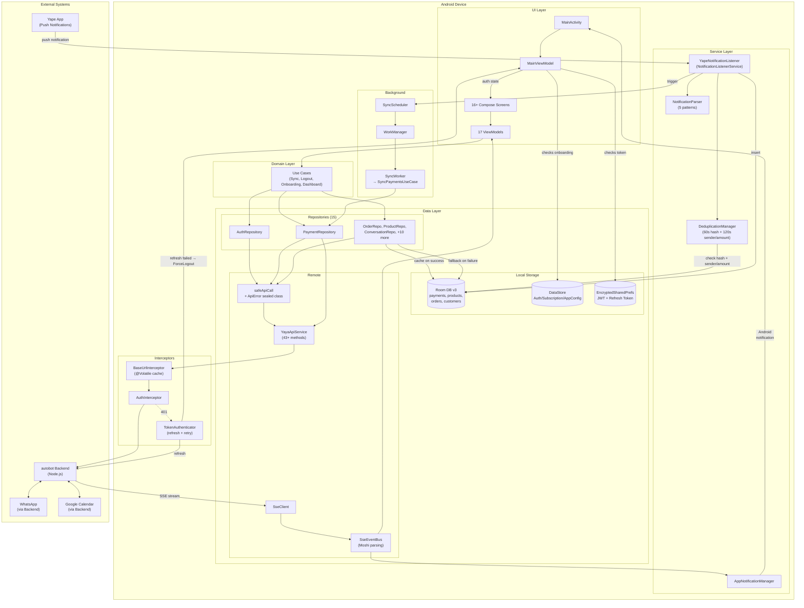

# Yaya Android — Architecture Documentation

## 1. System Overview

**Yaya** is an Android merchant app for small businesses in Latin America. It captures **Yape** (Peru's dominant mobile payment app) push notifications, manages products/orders/customers, provides WhatsApp-based conversational commerce with AI, and handles calendar/subscription management.

The app communicates with the **autobot** Node.js backend via REST API + Server-Sent Events (SSE).

**Tech Stack**: Kotlin, Jetpack Compose (Material 3), Hilt DI, Room, Retrofit + Moshi, WorkManager, OkHttp SSE.

**Package**: `com.example.yaya`
**Min SDK**: 24 (Android 7.0) | **Target SDK**: 36
**Build**: AGP 9.0.1, Kotlin 2.1.20, Java 17

---

## 2. Boot Sequence

```
Android OS launches YayaApplication
    │
    ├── @HiltAndroidApp → Hilt DI graph constructed
    │
    ├── onCreate():
    │   ├── syncScheduler.schedulePeriodicSync()     → WorkManager 15-min periodic job
    │   ├── networkMonitor.start()                   → ConnectivityManager callback
    │   ├── appNotificationManager.initialize()      → 3 notification channels + SSE observer
    │   ├── appScope.launch { backendUrl → baseUrlInterceptor.cachedBaseUrl }
    │   └── ProcessLifecycleOwner observer:
    │       ├── onStart → sseClient.connect() + networkMonitor.start()
    │       └── onStop  → sseClient.disconnect() + networkMonitor.stop()
    │
    └── WorkManager configured with HiltWorkerFactory
            │
            ▼
    MainActivity.onCreate()
    │
    ├── enableEdgeToEdge()
    └── setContent { YayaTheme { ... } }
            │
            ▼
    MainViewModel (auth state machine)
    │
    ├── Reads onboardingCompleted from AppConfigPreferences
    ├── Checks token via TokenManager.isTokenExpired()
    ├── Subscribes to AuthEventBus for force-logout
    │
    └── Emits AuthState:
        ├── Loading           → CircularProgressIndicator
        ├── NeedsOnboarding   → OnboardingNavGraph
        ├── Unauthenticated   → AuthNavGraph (Login / Register)
        └── Authenticated     → MainNavGraph (5 bottom tabs, 16+ screens)
```

**Key files:**
- `YayaApplication.kt` — app initialization, base URL sync, lifecycle observers
- `MainActivity.kt` — single Activity, Compose entry point
- `MainViewModel.kt` — auth state orchestration

---

## 3. Module-by-Module Breakdown

### 3.1 Dependency Injection (`di/`)

| Module | Provides | Scope |
|--------|----------|-------|
| `AppModule` | Room database (v3), PaymentDao, ProductDao, OrderDao, CustomerDao, TokenManager, DeduplicationManager, AuthEventBus | Singleton |
| `NetworkModule` | Moshi, OkHttpClient (2 interceptors + 1 authenticator), Retrofit, YayaApiService | Singleton |
| `RepositoryModule` | 15 repositories | Singleton |

**OkHttp chain:** `BaseUrlInterceptor` → `AuthInterceptor` → `HttpLoggingInterceptor` + `TokenAuthenticator`

### 3.2 Data Layer — Local Storage (`data/local/`)

**Room Database** (`YayaDatabase`, version 3, schema export enabled):

| Entity | Table | Purpose |
|--------|-------|---------|
| `Payment` | `payments` | Captured Yape payment notifications |
| `ProductEntity` | `products` | Offline product cache |
| `OrderEntity` | `orders` | Offline order cache |
| `CustomerEntity` | `customers` | Offline customer cache |

**Migrations:**
- v1 → v2: Added composite index on `payments(senderName, amount, capturedAt)`
- v2 → v3: Created `products`, `orders`, `customers` tables

**Payment entity fields:**

| Column | Type | Notes |
|--------|------|-------|
| id | Long (PK, auto) | Auto-generated |
| senderName | String | Parsed from notification |
| amount | Double | Amount in PEN (Soles) |
| rawNotification | String | Original notification text |
| notificationHash | String (indexed) | SHA-256 for deduplication |
| capturedAt | Long | Unix timestamp (ms) |
| paymentStatus | PaymentStatus | PENDING / CONFIRMED / REJECTED / EXPIRED |
| syncStatus | SyncStatus | UNSYNCED / SYNCING / SYNCED / FAILED |
| syncedAt | Long? | Timestamp when synced |
| backendId | String? | Backend-assigned payment ID |
| retryCount | Int | Failed sync attempt counter |

**Indices:** `notificationHash`, composite `(senderName, amount, capturedAt)`

**DataStore Preferences** — split into 3 focused classes sharing a single DataStore file (`yaya_preferences`):

| Class | Keys | Purpose |
|-------|------|---------|
| `AuthPreferences` | isLoggedIn, tenantId, tenantName, userId, userName, phoneNumber, apiKey | Auth & identity state |
| `SubscriptionPreferences` | planSlug, planName, canSendMessages, messagesUsed, messagesLimit, isPaidPlan | Subscription state |
| `AppConfigPreferences` | backendUrl, deviceId, onboardingCompleted | App configuration |

### 3.3 Data Layer — Remote / Networking (`data/remote/`)

**YayaApiService** — Retrofit interface with 43+ endpoint methods organized by domain: Auth, Dashboard, Products, Orders, Payments, Customers, Settings, Subscriptions, WhatsApp, Conversations, Product Extraction, Notifications, Calendar, Follow-up Flows, Yape Sync, Health.

**Error Handling** — `ApiError` sealed class hierarchy + `safeApiCall` utility:
```kotlin
sealed class ApiError : Exception() {
    data class Http(val code: Int, val errorBody: String?) : ApiError()
    data class Network(override val cause: Throwable) : ApiError()
    data class EmptyBody(val code: Int) : ApiError()
    data object Unauthorized : ApiError()
    data class Unknown(override val cause: Throwable) : ApiError()
}

suspend fun <T> safeApiCall(apiCall: suspend () -> Response<T>): Result<T>
```

All 15 repositories use `safeApiCall` for consistent error handling.

**AuthInterceptor**:
- Adds `Authorization: Bearer {token}` to all requests except public endpoints
- Public endpoints: `/api/v1/mobile/auth/login`, `/api/v1/mobile/auth/register`, `/api/v1/mobile/auth/refresh`, `/api/v1/health`

**TokenAuthenticator** (OkHttp `Authenticator`):
- On 401: attempts token refresh via `POST /api/v1/mobile/auth/refresh`
- Uses a dedicated `OkHttpClient` to avoid circular dependency
- `@Synchronized` to prevent concurrent refresh attempts
- On refresh failure: clears tokens, emits `ForceLogout` via `AuthEventBus`

**BaseUrlInterceptor**:
- `@Volatile var cachedBaseUrl` updated asynchronously from DataStore in `YayaApplication`
- No `runBlocking` — reads cached value synchronously in `intercept()`

**SseClient**:
- Custom SSE implementation using raw OkHttp with no read timeout
- Endpoint: `GET /api/v1/mobile/events`
- Exponential backoff: 2s base for first 10 retries, then fixed 60s interval (no cap)
- Network-aware: observes `NetworkMonitor.isOnline`, reconnects immediately when network returns
- Lifecycle-aware: connects on foreground, disconnects on background

**SseEventBus**:
- `SharedFlow<SseEvent>` with buffer capacity 64
- Events: `ConnectionUpdate`, `NewMessage`, `PaymentMatched`, `HealthAlert`, `AiUncertainty`, `Connected`, `Unknown`
- JSON parsing via Moshi `Map` adapter

**NetworkMonitor**:
- Wraps `ConnectivityManager.NetworkCallback`
- Exposes `StateFlow<Boolean>` for connectivity state
- `start()`/`stop()` lifecycle-managed in `YayaApplication`

### 3.4 Domain Layer (`domain/usecase/`)

| Use Case | Responsibility |
|----------|---------------|
| `SyncPaymentsUseCase` | Wraps `PaymentRepository.syncUnsyncedPayments()` with error logging |
| `CompleteOnboardingUseCase` | Saves business settings to backend + marks onboarding complete locally |
| `LogoutUseCase` | Coordinates SSE disconnect + WorkManager cancel + token clear + preferences clear |
| `RefreshDashboardUseCase` | Combines backend dashboard data with local payment counts/totals |

### 3.5 Yape Payment Capture Pipeline (`service/` + `worker/`)

```
Yape App sends push notification
        │
        ▼
YapeNotificationListener (NotificationListenerService)
│   Filters: packageName == "com.bcp.innovacxion.yapeapp"
│   Extracts: EXTRA_BIG_TEXT or EXTRA_TEXT
│   Validates: amount <= S/ 500,000
        │
        ▼
NotificationParser.parse(text)
│   Pattern 1: "(.+?) te envio S/ ([amount])"
│   Pattern 2: "Recibiste de (.+?) por S/ ([amount])"
│   Pattern 3: "(.+?) te ha[ns]? enviado S/ ([amount])"
│   Pattern 4: "Has recibido S/ ([amount]) de (.+)"
│   Pattern 5: "(.+?) te yapeo S/ ([amount])"
│   Amount format: S/ or S/. with commas/decimals
│   Fallback: logs unmatched Yape notifications containing S/
│   Returns: ParsedPayment(senderName, amount, rawText) or null
        │
        ▼
DeduplicationManager
│   Primary: SHA-256 hash within 60-second window
│   Secondary: sender+amount match within 120-second window
        │
        ▼
PaymentDao.insert(payment)   →   Room DB (syncStatus = UNSYNCED)
        │
        ▼
SyncScheduler.scheduleImmediateSync()   →   WorkManager OneTimeWork
        │
        ▼
SyncWorker.doWork()   →   SyncPaymentsUseCase   →   PaymentRepository
│   1 payment  → POST /api/v1/payments/sync
│   2+ payments → POST /api/v1/payments/sync/batch
│   Success: mark SYNCED + store backendId
│   Failure: mark FAILED + increment retryCount
│   Max retries: 5, backoff: 30s exponential
```

### 3.6 Security (`security/`)

**TokenManager**:
- Storage: `EncryptedSharedPreferences` (`yaya_secure_prefs`)
- Encryption: AES256-SIV (keys) + AES256-GCM (values), backed by Android Keystore
- JWT expiry: Manual Base64 decode of payload, reads `exp` claim
- Stores both access token and refresh token
- Error recovery: on `EncryptedSharedPreferences` creation failure (Keystore corruption), deletes corrupted file and recreates

### 3.7 UI Layer (`ui/`)

**Navigation** — 3 nav graphs driven by `MainViewModel.authState`:
- `OnboardingNavGraph`: 8-step guided setup (welcome → business type → info → account → WhatsApp QR → first product → notification access → done)
- `AuthNavGraph`: Login / Register
- `MainNavGraph`: 5 bottom tabs (Home, Chats, Products, Orders, Profile) + detail screens

**OnboardingViewModel** decomposition:
- `OnboardingStepManager` — pure Kotlin step navigation + validation (easily unit-testable)
- `WhatsAppConnectionDelegate` — QR polling, status polling, connect/disconnect
- `OnboardingViewModel` — coordinator (~220 lines) that owns UiState and delegates

**Screens** (16 features):

| Feature | Screen(s) | ViewModel |
|---------|-----------|-----------|
| Auth | Login, Register | LoginVM, RegisterVM |
| Onboarding | Onboarding (8 steps) | OnboardingVM |
| Dashboard | Dashboard | DashboardVM |
| Payments | PaymentList | PaymentListVM |
| Orders | OrderList, OrderDetail | OrderListVM, OrderDetailVM |
| Products | ProductList, ProductForm | ProductListVM, ProductFormVM |
| Customers | CustomerList, CustomerDetail | CustomerListVM, CustomerDetailVM |
| Conversations | ConversationList, ChatDetail | ConversationListVM, ChatDetailVM |
| WhatsApp | WhatsApp | WhatsAppVM |
| Calendar | Calendar | CalendarVM |
| Subscriptions | SubscriptionList | SubscriptionListVM |
| Store | Store | StoreVM |
| Settings | Settings | SettingsVM |
| Profile | Profile | ProfileVM |
| Product Extraction | ProductExtraction | ProductExtractionVM |
| Follow-up Flows | FollowUpFlows | FollowUpFlowsVM |
| Notifications | NotificationSettings | NotificationSettingsVM |

**Shared Components**: `PaymentCard`, `OrderCard`, `OrderStatusBadge`, `StatusBadge`, `SyncStatusIndicator`, `CountryCodePicker`

### 3.8 Background Workers (`worker/`)

**SyncWorker** — `HiltWorker` / `CoroutineWorker`. Max 5 retries. Uses `SyncPaymentsUseCase`.

**SyncScheduler** — three modes:
- Immediate: `OneTimeWork`, `ExistingWorkPolicy.REPLACE`, network required
- Periodic: every 15 minutes, `ExistingPeriodicWorkPolicy.KEEP`, network required
- Cancel all: stops both immediate and periodic work (used by `LogoutUseCase`)
- Both enqueue modes use exponential backoff (30s base)

**AppNotificationManager** — singleton that observes `SseEventBus` and posts Android notifications:
- `yaya_messages` channel: incoming WhatsApp messages
- `yaya_orders` channel: payment confirmations
- `yaya_alerts` channel: health alerts, AI uncertainty events

### 3.9 Utilities (`util/`)

**ImageCompressor** — product image upload validation:
- MIME type validation: JPEG, PNG, WebP only
- Auto-compression: images >1MB resized to max 1920px longest edge, JPEG quality 80%

---

## 4. Offline Support

Products, orders, and customers support network-first with cache fallback:

```kotlin
suspend fun getProducts(): Result<List<ProductDto>> =
    safeApiCall { apiService.getProducts() }
        .onSuccess { productDao.insertAll(it.map { dto -> dto.toEntity() }) }
        .recoverCatching {
            val cached = productDao.getAll()
            if (cached.isNotEmpty()) cached.map { it.toDto() }
            else throw it
        }
```

Payments are always stored locally first (offline-first) and synced via WorkManager.

---

## 5. Data Flow Diagram



---

## 6. External Integrations & Failure Modes

| Integration | Mechanism | Failure Mode | Recovery |
|---|---|---|---|
| **autobot Backend** | Retrofit REST (30s timeout) | Network errors, 4xx/5xx | `safeApiCall` returns typed `ApiError`. Products/orders/customers fall back to Room cache. Payments retry via WorkManager. |
| **Token Expiry** | JWT with refresh token | 401 on any request | `TokenAuthenticator` attempts refresh. On refresh failure: force logout via `AuthEventBus`. |
| **Yape Notifications** | `NotificationListenerService` (OS-level permission) | Permission revoked; format change | 5 regex patterns + fallback logging for unmatched notifications containing `S/`. |
| **SSE Real-time** | Custom OkHttp SSE to `GET /api/v1/mobile/events` | Connection drop, server restart | Exponential backoff (10 retries), then fixed 60s interval. Network-aware reconnection. |
| **WorkManager Sync** | Periodic (15m) + immediate OneTimeWork | Network unavailable, server error | `BackoffPolicy.EXPONENTIAL` (30s base), max 5 retries. |
| **Google Calendar** | OAuth flow via backend redirect URLs | Auth URL failure | Error shown in UI; user-initiated retry. |
| **WhatsApp** | Backend-proxied (Baileys library) | QR timeout, connection drop | User-initiated reconnect; SSE `health-alert` events. |
| **EncryptedSharedPrefs** | AndroidX Security Crypto + Keystore | Keystore corruption on OS upgrade | Auto-recovery: deletes corrupted file, recreates. User re-authenticates. |

---

## 7. API Contract — Boundary with autobot Backend

### Authentication

All protected endpoints require header: `Authorization: Bearer <jwt-token>`

Public endpoints (no auth required):
- `POST /api/v1/mobile/auth/register`
- `POST /api/v1/mobile/auth/login`
- `POST /api/v1/mobile/auth/refresh`
- `GET /api/v1/health`

### Endpoint Reference

#### Auth
| Method | Path | Request Body | Response |
|--------|------|-------------|----------|
| POST | `/api/v1/mobile/auth/register` | `MobileRegisterRequest` | `AuthResponse` |
| POST | `/api/v1/mobile/auth/login` | `MobileLoginRequest` | `AuthResponse` |
| POST | `/api/v1/mobile/auth/refresh` | `RefreshTokenRequest` | `RefreshTokenResponse` |

`AuthResponse`: `{ token: String, tenant: TenantDto, user: UserDto, subscription: PlatformSubscriptionStatus? }`

#### Dashboard
| Method | Path | Response |
|--------|------|----------|
| GET | `/api/v1/dashboard` | `DashboardDto` |

#### Products (CRUD)
| Method | Path | Request | Response |
|--------|------|---------|----------|
| GET | `/api/v1/products?search=&category=` | — | `List<ProductDto>` |
| GET | `/api/v1/products/{id}` | — | `ProductDto` |
| POST | `/api/v1/products` | `CreateProductRequest` | `ProductDto` |
| PUT | `/api/v1/products/{id}` | `UpdateProductRequest` | `ProductDto` |
| DELETE | `/api/v1/products/{id}` | — | `Unit` |
| POST | `/api/v1/mobile/upload/product-image` | `Multipart (image)` | `ImageUploadResponse` |

#### Orders
| Method | Path | Request | Response |
|--------|------|---------|----------|
| GET | `/api/v1/orders?limit=50&offset=0&status=` | — | `OrderListResponse` |
| GET | `/api/v1/orders/{id}` | — | `OrderDetailDto` |
| PUT | `/api/v1/orders/{id}/status` | `UpdateOrderStatusRequest` | `OrderDto` |

#### Payments
| Method | Path | Request | Response |
|--------|------|---------|----------|
| GET | `/api/v1/payments/pending` | — | `List<PendingPaymentDto>` |
| POST | `/api/v1/payments/{id}/confirm` | `ConfirmPaymentRequest` | `PaymentActionResponse` |
| POST | `/api/v1/payments/{id}/reject` | — | `PaymentActionResponse` |

#### Yape Payment Sync
| Method | Path | Request | Response |
|--------|------|---------|----------|
| POST | `/api/v1/payments/sync` | `PaymentSyncRequest` | `PaymentSyncResponse` |
| POST | `/api/v1/payments/sync/batch` | `BatchSyncRequest` | `BatchSyncResponse` |

#### Customers
| Method | Path | Response |
|--------|------|----------|
| GET | `/api/v1/customers` | `List<CustomerDto>` |
| GET | `/api/v1/customers/{id}` | `CustomerDto` |

#### Settings
| Method | Path | Request | Response |
|--------|------|---------|----------|
| GET | `/api/v1/settings` | — | `Map<String, String>` |
| PUT | `/api/v1/settings/{key}` | `UpdateSettingRequest { value }` | `Unit` |

#### Creator Subscriptions
| Method | Path | Request | Response |
|--------|------|---------|----------|
| GET | `/api/v1/creator/plans` | — | `List<CreatorPlanDto>` |
| GET | `/api/v1/creator/subscriptions?status=&limit=&offset=` | — | `CustomerSubscriptionListResponse` |
| POST | `/api/v1/creator/subscriptions` | `SubscribeCustomerRequest` | `CustomerSubscriptionDto` |
| POST | `/api/v1/creator/subscriptions/{id}/cancel` | — | `CustomerSubscriptionDto` |

#### Platform Subscription
| Method | Path | Request | Response |
|--------|------|---------|----------|
| GET | `/api/v1/mobile/subscription` | — | `PlatformSubscriptionStatus` |
| GET | `/api/v1/mobile/plans` | — | `List<PlatformPlanDto>` |
| POST | `/api/v1/mobile/subscription/subscribe` | `SubscribePlanRequest` | `PlatformSubscriptionStatus` |

#### WhatsApp
| Method | Path | Response |
|--------|------|----------|
| GET | `/api/v1/mobile/whatsapp/status` | `WhatsAppStatusDto` |
| GET | `/api/v1/mobile/whatsapp/qr` | `WhatsAppQrDto` |
| POST | `/api/v1/mobile/whatsapp/connect` | `WhatsAppActionResponse` |
| POST | `/api/v1/mobile/whatsapp/disconnect` | `WhatsAppActionResponse` |
| POST | `/api/v1/mobile/whatsapp/reset` | `WhatsAppActionResponse` |

#### Conversations
| Method | Path | Request | Response |
|--------|------|---------|----------|
| GET | `/api/v1/mobile/conversations?limit=&offset=` | — | `ConversationListResponse` |
| GET | `/api/v1/mobile/conversations/{jid}/messages?limit=&offset=` | — | `ConversationMessagesResponse` |
| POST | `/api/v1/mobile/conversations/{jid}/send` | `SendMessageRequest` | `SendMessageResponse` |
| POST | `/api/v1/mobile/conversations/{jid}/pause-ai` | `PauseAiRequest` | `PauseAiResponse` |

#### Product Extraction (AI)
| Method | Path | Request | Response |
|--------|------|---------|----------|
| POST | `/api/v1/mobile/products/extract/from-voice` | `Multipart (audio)` | `ExtractionResponse` |
| POST | `/api/v1/mobile/products/extract/from-voice` | `VoiceExtractionTextRequest` | `ExtractionResponse` |
| POST | `/api/v1/mobile/products/extract/from-photo` | `Multipart (image)` | `ExtractionResponse` |

#### Notification Settings
| Method | Path | Request | Response |
|--------|------|---------|----------|
| GET | `/api/v1/mobile/notifications/settings` | — | `NotificationSettingsDto` |
| POST | `/api/v1/mobile/notifications/settings` | `UpdateNotificationSettingsRequest` | `OkResponse` |

#### Google Calendar
| Method | Path | Request | Response |
|--------|------|---------|----------|
| GET | `/api/v1/mobile/calendar/auth-url` | — | `CalendarAuthUrlResponse` |
| POST | `/api/v1/mobile/calendar/callback` | `CalendarCallbackRequest` | `CalendarCallbackResponse` |
| GET | `/api/v1/mobile/calendar/status` | — | `CalendarStatusResponse` |
| POST | `/api/v1/mobile/calendar/disconnect` | — | `SuccessResponse` |
| GET | `/api/v1/mobile/calendar/events?days=7&maxResults=50` | — | `CalendarEventsResponse` |
| POST | `/api/v1/mobile/calendar/sync-appointment` | `SyncAppointmentRequest` | `SyncAppointmentResponse` |
| DELETE | `/api/v1/mobile/calendar/events/{eventId}` | — | `SuccessResponse` |

#### Follow-up Flows
| Method | Path | Request | Response |
|--------|------|---------|----------|
| GET | `/api/v1/mobile/followup-flows` | — | `List<FollowUpFlowDto>` |
| POST | `/api/v1/mobile/followup-flows/{type}/toggle` | `ToggleFlowRequest` | `OkResponse` |

#### SSE Events
| Endpoint | `GET /api/v1/mobile/events` |
|----------|---------------------------|
| Headers | `Authorization: Bearer {token}`, `Accept: text/event-stream` |
| Format | Standard SSE (`event:` + `data:` lines, blank line delimiter) |

**Event types:**
| Event | Payload Fields |
|-------|---------------|
| `connection-update` | `{ status }` |
| `new-message` | `{ jid, direction, preview, timestamp, pushName? }` |
| `payment-matched` | `{ paymentId, orderId, customerJid }` |
| `health-alert` | `{ message }` |
| `ai-uncertainty` | `{ jid, reason }` |
| `connected` | `{ tenantId }` |

#### Health
| Method | Path | Response |
|--------|------|----------|
| GET | `/api/v1/health` | `Unit` |

---

## 8. Test Coverage

| Test File | Coverage |
|-----------|----------|
| `NotificationParserTest` | 5 patterns + edge cases (19 tests) |
| `DeduplicationManagerTest` | Hash computation, time window logic, sender+amount dedup |
| `PaymentRepositoryTest` | Sync success/failure paths, retry increment |
| `AuthInterceptorTest` | Token injection, public path skip (4 endpoints), null token |
| `SseEventBusTest` | All 6 event types, malformed JSON, empty JSON |
| `OnboardingStepManagerTest` | Step validation, navigation, skip logic |

Test dependencies: JUnit 4, kotlinx-coroutines-test, MockK, OkHttp MockWebServer.

---

## 9. Remaining Technical Debt

1. **No crash analytics** — Firebase Crashlytics or equivalent not yet integrated (requires `google-services.json` setup)
2. **Hardcoded Spanish strings** — Validation/error messages in ViewModels should reference `R.string.*` (string resources defined in `strings.xml`, not yet wired)
3. **Legacy `PreferencesManager`** — Facade class still exists but has no callers; can be deleted
4. **Token refresh endpoint** — `TokenAuthenticator` is implemented client-side; backend must implement `POST /api/v1/mobile/auth/refresh`
5. **Release base URL** — `BuildConfig.BASE_URL` release value is placeholder `https://api.yaya.pe/`; replace with actual production URL
