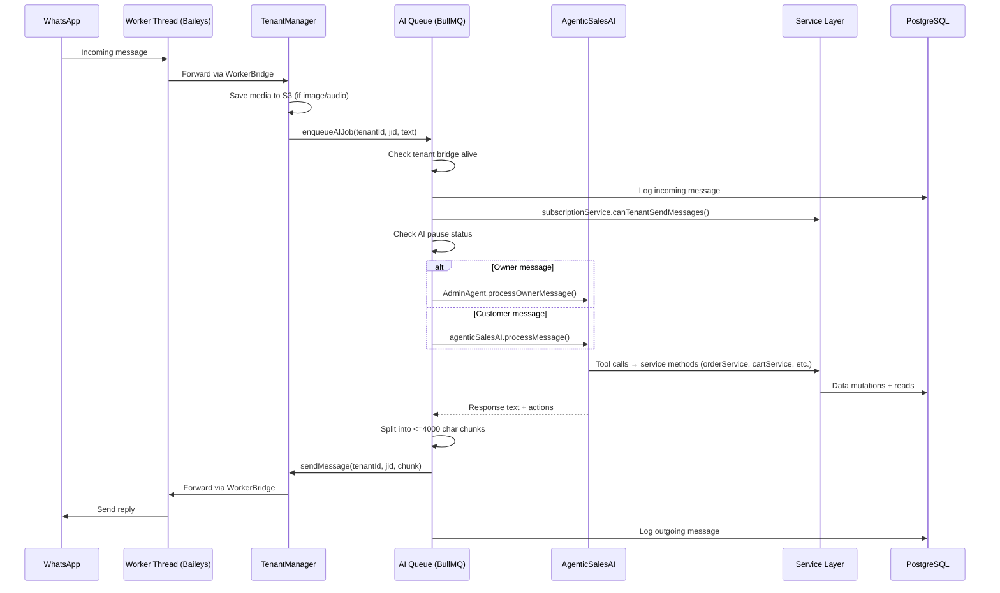
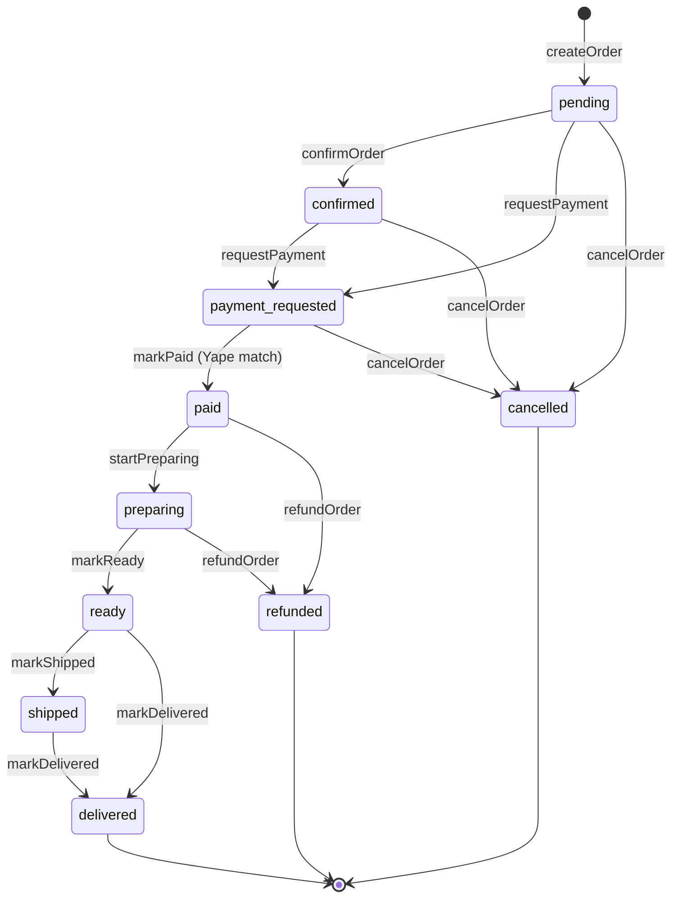
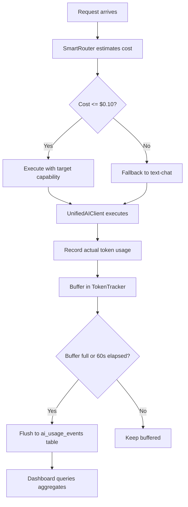
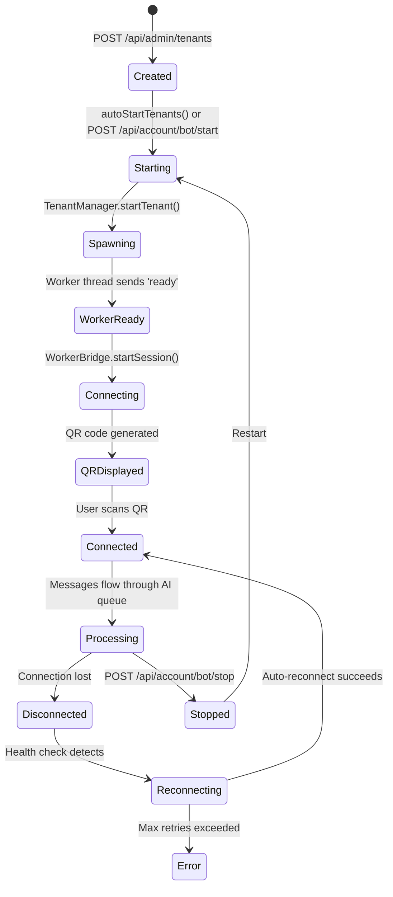

# Autobot — Architecture Document

> Multi-tenant WhatsApp commerce platform with AI-powered sales agents, media processing, business intelligence, and admin dashboards.

---

## 1. System Overview

Autobot is a Node.js/TypeScript platform that connects businesses to their customers via WhatsApp. Each tenant (business) gets an isolated WhatsApp connection running in a dedicated worker thread, with AI-powered sales agents that handle customer conversations, take orders, process payments, and manage appointments — all autonomously.

**Core capabilities:**
- Multi-tenant WhatsApp bot (Baileys library)
- AI sales agent with tool calling (LangChain + OpenAI-compatible LLMs)
- Multi-model AI routing (text, vision, OCR, audio, multimodal)
- Product catalog, order management, payment processing (Yape)
- Appointment booking with Google Calendar integration
- Media processing pipeline (images, video, audio via FFmpeg/Sharp)
- Business intelligence and daily AI-generated reports
- Admin dashboard + customer self-service portal
- SaaS subscription management (platform plans + creator plans)

**Tech stack:** Express 5, PostgreSQL 16, Redis 7, BullMQ, Baileys, LangChain, MinIO/S3, Better Auth, Pino logging.

---

## 2. Boot Sequence

Entry: `src/index.ts` → `startPlatform(WEB_PORT)` in `src/platform.ts`.

```
1.  migrateAuthTables()              — Better Auth schema setup
2.  seedAdminIfNeeded()              — Create admin user from env vars
3.  ensureBuckets()                  — Create S3/MinIO buckets (media-raw, media-processed, warehouse-exports)
4.  createWebServer(port)            — Express app with 25+ route groups
5.  startAIWorker()                  — BullMQ worker for AI message processing
6.  startMediaWorker()               — BullMQ worker for media transcoding
7.  startPartitionManager()          — PostgreSQL table partitioning (warehouse)
8.  startETLRunner()                 — Extract/Transform/Load pipeline
9.  tenantManager.autoStartTenants() — Load all active tenants, spawn worker threads
10. startHealthCheck()               — Monitor tenant connections on interval
11. startConversationCleanup()       — Purge old conversation data
12. startReminderScheduler()         — Appointment reminders (BullMQ scheduler)
13. startPaymentFollowupScheduler()  — Payment follow-ups
14. initializeDailySummaryScheduler()— AI-generated daily reports
15. initializeFollowupScheduler()    — Customer follow-ups
16. notificationService.registerEventListeners() — Event-driven WhatsApp notifications
17. Return shutdown function (reverse teardown order)
```

Graceful shutdown on SIGINT/SIGTERM stops all services in reverse order, closes queues, disconnects tenants, and closes Redis.

---

## 3. Module Breakdown

### `src/services/` — Service Layer (Business Logic)

The service layer owns all state machines, business rules, and domain mutations. AI tools, routes, and schedulers are thin callers. Repositories are pure data access.

| File | Responsibility |
|------|---------------|
| `errors.ts` | `ServiceError` hierarchy: `NotFoundError` (404), `InvalidTransitionError` (409), `OwnershipError` (404), `InsufficientStockError` (409). |
| `index.ts` | Barrel exports for all services. |
| `order-service.ts` | Order lifecycle state machine (`pending → confirmed → payment_requested → paid → preparing → ready → shipped → delivered`, with `cancelled`/`refunded` terminal states). Enforces transitions via `assertTransition`. Methods: `createOrder`, `confirmOrder`, `cancelOrder`, `requestPayment`, `markPaid`, `refundOrder`, `modifyOrder`, `startPreparing`, `markReady`, `markShipped`, `markDelivered`, `verifyOwnership`. Emits domain events. |
| `payment-service.ts` | Yape payment matching engine. `syncYapeNotification` (dedup + create + match), `matchOrderPayment` (exact-amount auto-confirm for single matches), `matchSubscriptionPayment` (subscription renewal on match), `validatePaymentForOrder` (checks confirmed or tries unmatched notifications). |
| `cart-service.ts` | Redis-backed persistent cart (key: `cart:{tenantId}:{jid}`, 24h TTL). `addItem`, `removeItem`, `updateQuantity`, `clearCart`, `getCartTotal`, `convertCartToOrder`. |
| `catalog-service.ts` | Stock alerts (auto-deactivates at 0), inventory status, product recommendations (popularity for new customers, category-based for returning), business hours (from tenant settings), sales analytics, comprehensive analytics. |
| `subscription-service.ts` | Tenant + customer subscription management. `canTenantSendMessages` (message limit enforcement), `subscribeTenant`, `cancelTenantSubscription`, `getTenantSubscriptionStatus`, `calculatePeriodEnd`. |
| `appointment-service.ts` | Appointment booking with slot conflict detection, business-hours-aware slot generation (reads from tenant settings, fallback 9-18). `bookAppointment`, `getAvailableSlots`, `cancelAppointment`, `confirmAppointment`, `completeAppointment`, `markNoShow`. |
| `delivery-service.ts` | Rider assignment (auto-assign first available or specific), status transitions (`assigned → picked_up → delivered`), rider notification via WhatsApp with auto-generated messages. |
| `notification-service.ts` | Event-driven WhatsApp notifications. Subscribes to `appBus` events (payment confirmed, low stock, out of stock) and sends tenant-appropriate messages. |

### `src/bot/` — WhatsApp Connection Layer

| File | Responsibility |
|------|---------------|
| `tenant-manager.ts` | Singleton orchestrator. Spawns/stops worker threads per tenant. Routes messages, saves media to S3, manages bridges. |
| `worker-bridge.ts` | Main ↔ Worker thread IPC. Typed command/event protocol with heartbeat monitoring. |
| `worker.ts` | Worker thread script. Runs Baileys connection inside `worker_threads`. |
| `connection.ts` | Baileys socket creation, auth state management, message/event dispatch. |
| `handler.ts` | Single-tenant message handler. Rules matching, rate limiting, auto-reply. Used in legacy single-tenant mode. |
| `rules-engine.ts` | Pattern matching: exact, contains, regex. Scope filtering (private/group/all). |
| `health-check.ts` | Periodic tenant connection monitoring. Emits `tenant-health-alert` events. |
| `providers/baileys.ts` | Baileys provider abstraction. |
| `providers/pg-auth-state.ts` | Persists Baileys auth state to PostgreSQL instead of filesystem. |

### `src/ai/` — AI Agent System

| File | Responsibility |
|------|---------------|
| `orchestrator.ts` | Master AI coordinator. Routes requests by capability (text/vision/OCR/audio). Cost estimation. |
| `agentic-sales.ts` | Customer-facing sales agent. Intent detection, product matching, cart management, order creation. |
| `admin-agent.ts` | Business owner configuration chatbot. Extracts business context from owner conversations. |
| `business-intelligence.ts` | 7-day analytics: AI usage, sales metrics, customer intents. AI-generated daily reports. |
| `agent.ts` | LangChain agent integration. Conversation history management (max 20 pairs). |
| `agent-runner.ts` | Agent execution with tool calling via LangGraph. |
| `client.ts` | OpenAI-compatible API client wrapper. |
| `system-prompt.ts` | Dynamic system prompt generation per tenant (uses business context). |
| `token-tracking.ts` | Legacy token tracking. |
| `llm.ts` | LLM initialization helpers. |
| `history.ts` | Conversation history retrieval. |
| `cleanup.ts` | Conversation data cleanup on interval. |
| `escalation-detector.ts` | Detects when to hand off to human. |
| `image-collector.ts` | Collects image references from conversations. |
| `product-extraction.ts` | Extracts product info from images/text. |
| `merchant-agent.ts` | Merchant-facing AI agent for business queries. |
| `capabilities/config.ts` | Per-model pricing, token limits, media constraints. |
| `capabilities/types.ts` | AICapability union type, message/content types, usage types. |
| `clients/unified-client.ts` | Multi-model client wrapper. Routes to correct provider by capability. |
| `router/smart-router.ts` | Intelligent request routing. Cost estimation, fallback strategies. |
| `preprocessing/media-decoder.ts` | Image/video/audio preprocessing for AI. Resize, format convert, frame extraction. |
| `tracking/token-tracker.ts` | In-memory buffer → auto-flush to PostgreSQL. Cost projection. |
| `tracking/usage-repository.ts` | Database persistence for AI usage events. |
| `tools/index.ts` | Tool registry. Dynamically selects tools based on tenant's business type. |
| `tools/registry.ts` | Tool registration and lookup. |
| `tools/*.ts` | 30+ individual tool implementations. Each is a thin wrapper (~15 lines) that delegates to the service layer for business logic. |
| `tools/merchant/*.ts` | Merchant-specific tools (query-warehouse, sales-summary, revenue-report). |
| `tools/vision/*.ts` | Vision processing tools. |
| `flows/` | Agent flow configurations and resolution. |

### `src/db/` — Data Access Layer

Pure data access — no business logic. Services own all state transitions and domain rules.

| File | Responsibility |
|------|---------------|
| `pool.ts` | PostgreSQL connection pool (max 20, idle 30s, connect timeout 5s). `query()`, `queryOne()`, `transaction()`. |
| `base-repository.ts` | Generic CRUD. Multi-tenant filtering, soft delete, pagination. |
| `row-mapper.ts` | Spec-based row → entity transformer. Handles date/number/JSON conversions. |
| `row-types.ts` | Raw PostgreSQL row interfaces. |
| `tenants-repo.ts` | Tenant CRUD, API key generation/rotation, slug lookup. |
| `customers-repo.ts` | Customer CRUD, JID lookup, location tracking, tag management. |
| `products-repo.ts` | Product catalog, search, category filtering, low stock queries. |
| `orders-repo.ts` | Transactional order creation (validates stock, creates items, decrements inventory). Order modification with atomic restock. |
| `payments-repo.ts` | Payment lifecycle (pending → confirmed/rejected). |
| `refunds-repo.ts` | Refund creation and tracking. |
| `riders-repo.ts` | Delivery rider management, location tracking. |
| `delivery-assignments-repo.ts` | Order-to-rider assignment with status lifecycle. |
| `appointments-repo.ts` | Appointment CRUD, slot overlap detection, reminder tracking. |
| `pg-messages-repo.ts` | Message logging, conversation list with unread counts. |
| `pg-rules-repo.ts` | Auto-reply pattern rules CRUD. |
| `business-context-repo.ts` | AI agent configuration storage (business description, tone, hours, instructions). |
| `conversations-repo.ts` | Redis (hot, 24h TTL) + PostgreSQL (cold) hybrid conversation cache. |
| `sessions-repo.ts` | WhatsApp connection state tracking. |
| `settings-repo.ts` | Key-value settings with tenant → global fallback chain. |
| `devices-repo.ts` | Mobile device registration (for Yape notifications). |
| `token-usage-repo.ts` | AI usage event persistence. |
| `ai-paused-repo.ts` | Per-contact AI pause state. |
| `media-assets-repo.ts` | Media file metadata. |
| `evaluations-repo.ts` | Agent evaluation/feedback for ML training. |
| `encryption-keys-repo.ts` | Encryption key management. |
| `tenant-subscriptions-repo.ts` | SaaS subscription CRUD. |
| `customer-subscriptions-repo.ts` | Creator content subscription CRUD. |
| `creator-plans-repo.ts` | Creator plan definitions. |
| `platform-plans-repo.ts` | Platform plan definitions. |
| `subscription-payments-repo.ts` | Subscription payment records. |
| `mobile-users-repo.ts` | Mobile app user management. |
| `yape-notifications-repo.ts` | Yape payment notification storage and matching state. |
| `migrations/` | SQL migration files (001-009 + ai_usage_tracking). |

### `src/queue/` — Job Queue System

| File | Responsibility |
|------|---------------|
| `ai-queue.ts` | AI message processing worker. Connection-aware routing, subscription checks (via `subscriptionService`), admin/customer routing, message chunking. |
| `queue-factory.ts` | Generic BullMQ wrapper. Redis connection pooling, retry config, cleanup policies. |
| `scheduler-factory.ts` | Generic periodic job scanner + processor. |
| `reminder-scheduler.ts` | Appointment reminders. |
| `payment-followup-scheduler.ts` | Payment follow-ups for unpaid orders. |
| `followup-scheduler.ts` | Customer follow-up messages. |
| `daily-summary-scheduler.ts` | AI-generated daily business reports. |
| `rate-limiter.ts` | Per-tenant concurrency control (Redis-based). |
| `redis.ts` | Shared Redis client. |
| `types.ts` | Queue job data/result type definitions. |

### `src/web/` — HTTP Server & API

| File | Responsibility |
|------|---------------|
| `server.ts` | Express app setup: security headers, CORS, 25+ route groups, error handler, SPA fallback. |
| `middleware/session-auth.ts` | `requireSession` (Better Auth cookie), `requireAdmin` (role check), `requireCustomer` (tenant check). |
| `middleware/device-auth.ts` | Device token authentication for mobile/Yape. |
| `middleware/mobile-auth.ts` | Mobile app JWT authentication. |
| `middleware/tenant-auth.ts` | API key-based tenant authentication. |
| `routes/api-admin.ts` | Platform admin: metrics, token usage, tenant management. |
| `routes/api-ai-usage.ts` | AI usage dashboard, per-tenant/model breakdown, export. |
| `routes/api-business-intelligence.ts` | Business insights, daily reports, sales summaries. |
| `routes/api-account.ts` | Tenant self-service: profile, API key rotation, bot start/stop/reset, QR code. |
| `routes/api-rules.ts` | Auto-reply rules CRUD. |
| `routes/api-messages.ts` | Conversation history, message list. |
| `routes/api-status.ts` | Bot state, connection status, toggle auto-reply. |
| `routes/api-web.ts` | Tenant data: products, orders, customers, payments, settings, product images. Analytics via `catalogService`. |
| `routes/api-tenants.ts` | Admin tenant CRUD. |
| `routes/api-register.ts` | Public tenant registration. |
| `routes/api-queue.ts` | Queue monitoring and management. |
| `routes/api-yape.ts` | Yape payment notification webhook. Routes through `paymentService`. |
| `routes/api-calendar.ts` | Google Calendar OAuth and appointment sync. |
| `routes/api-subscriptions.ts` | Platform subscription management via `subscriptionService`. |
| `routes/api-customer-subscriptions.ts` | Creator content subscriptions. |
| `routes/api-creator-plans.ts` | Creator plan management. |
| `routes/api-platform-plans.ts` | Platform plan listing + admin management. |
| `routes/api-merchant-ai.ts` | Merchant AI assistant endpoints. |
| `routes/api-mobile.ts` | Mobile app data endpoints. |
| `routes/api-mobile-auth.ts` | Mobile app authentication. |
| `routes/api-mobile-events.ts` | Mobile event streaming. |
| `routes/media-routes.ts` | Media upload/download/presigned URLs. |
| `routes/warehouse-routes.ts` | Data warehouse queries and exports. |
| `routes/encryption-routes.ts` | Encryption key management. |
| `routes/api-product-extraction.ts` | AI-based product extraction from images. |
| `routes/core/*.ts` | Business entity CRUD (customers, orders, products, payments, refunds, settings). |
| `routes/handlers/shared-handlers.ts` | Reusable route handler patterns. Routes order/payment mutations through services. |
| `shared/route-helpers.ts` | Response formatting utilities. |
| `public/admin/` | Admin dashboard SPA (vanilla JS). |
| `public/customer/` | Customer portal SPA (vanilla JS). |
| `public/shared/` | Shared CSS, auth, theme, utilities. |

### `src/media/` — Media Processing

| File | Responsibility |
|------|---------------|
| `s3-client.ts` | MinIO/S3 client, bucket creation, presigned URLs. |
| `storage.ts` | Upload helpers, file type detection. |
| `media-queue.ts` | BullMQ media processing worker. |
| `streaming.ts` | Media streaming endpoint. |
| `processors/ffmpeg.ts` | FFmpeg wrapper for transcoding. |
| `processors/audio-processor.ts` | Audio extraction and conversion. |
| `processors/video-processor.ts` | Video frame extraction, thumbnail generation. |

### `src/warehouse/` — Data Analytics Pipeline

| File | Responsibility |
|------|---------------|
| `etl-runner.ts` | Extract/Transform/Load on interval. |
| `partitions.ts` | PostgreSQL table partitioning management. |
| `training-export.ts` | Export conversation data for ML training. |

### `src/crypto/` — Encryption

| File | Responsibility |
|------|---------------|
| `envelope.ts` | AES-256-GCM envelope encryption for sensitive data (Google Calendar tokens). |

### `src/integrations/` — External Services

| File | Responsibility |
|------|---------------|
| `google-calendar.ts` | OAuth2 flow, token refresh, calendar event creation. Encrypted token storage. |

### `src/shared/` — Cross-Cutting Concerns

| File | Responsibility |
|------|---------------|
| `events.ts` | TypedEmitter event bus (27 event types including domain events for orders, appointments, deliveries). In-process, no persistence. |
| `types.ts` | All shared TypeScript interfaces (Rule, Order, Customer, Product, Payment, Tenant, etc.). |
| `logger.ts` | Pino logger (pretty in dev, JSON in prod). |
| `message-templates.ts` | i18n message templates (Spanish/English). |
| `message-utils.ts` | Message chunking (4000 char WhatsApp limit), text utilities. |

### `src/auth/` — Authentication

| File | Responsibility |
|------|---------------|
| `auth.ts` | Better Auth setup with admin plugin. Table migration, admin user seeding. |

---

## 4. Data Flow Diagrams

### 4.1 Message Processing Flow



### 4.2 Order Lifecycle State Machine



### 4.3 Service Layer Call Flow

```
AI Tool (thin wrapper, ~15 lines)
  → verifyOwnership (if customer-facing)
  → Service method (business logic, state machine)
    → Repository (pure data access)
    → appBus.emit (domain events)
```

Routes and schedulers follow the same pattern: delegate to services for all mutations.

### 4.4 AI Cost Control Flow



### 4.5 Tenant Lifecycle



### 4.6 Data Model Relationships

```
tenants (1)
├── customers (many)
│   ├── orders (many)
│   │   ├── order_items (many) → products
│   │   ├── payments (many)
│   │   ├── refunds (many) → payments
│   │   └── delivery_assignments (many) → riders
│   ├── appointments (many)
│   └── customer_subscriptions (many) → creator_plans
├── products (many)
├── riders (many)
├── rules (many)
├── message_log (many)
├── conversation_reads (many)
├── business_context (1)
├── tenant_admin_settings (1)
├── settings (many, key-value)
├── sessions (1, WhatsApp state)
├── devices (many, mobile/Yape)
├── ai_usage_events (many)
├── tenant_subscriptions (many) → platform_plans
├── creator_plans (many)
└── admin_conversations (many, training data)
```

---

## 5. External Integrations & Failure Modes

### Baileys / WhatsApp Web

- **Library:** `@whiskeysockets/baileys@7.0.0-rc.9` (release candidate)
- **Connection:** WebSocket to WhatsApp servers via worker threads
- **Auth:** Persisted to PostgreSQL (`pg-auth-state.ts`)
- **Failure modes:**
  - Connection drops → auto-reconnect with backoff, health check monitors via `startHealthCheck()`
  - QR expiry → re-generate on next scan attempt
  - Rate limits → 3s per-JID rate limiter in handler, per-tenant concurrency limiter in queue
  - Auth invalidation → requires re-scan of QR code
- **Risk:** RC library version — API changes possible

### PostgreSQL

- **Driver:** `pg@8.19.0` with connection pool
- **Config:** Max 20 connections, 30s idle timeout, 5s connect timeout
- **Failure modes:**
  - Pool exhaustion → requests block until connection freed (no explicit timeout on waiting)
  - Query timeout → no explicit statement timeout set
  - Connection loss → pool auto-reconnects individual connections
- **Risk:** No read replicas; single pool shared by all tenants

### Redis / BullMQ

- **Driver:** `ioredis@5.10.0`
- **Usage:** Job queues (AI, media), conversation cache, rate limiting, persistent cart
- **Config:** Retry 3x with 5s delay, keep 1000 completed / 5000 failed jobs
- **Failure modes:**
  - Redis unavailable → queues pause, conversation cache falls back to PostgreSQL, cart unavailable
  - Stale jobs → BullMQ's stalled job detection
  - Memory pressure → no eviction policy configured
- **Risk:** Multiple independent ioredis instances created

### S3 / MinIO

- **Driver:** `@aws-sdk/client-s3@3.1001.0`
- **Buckets:** `media-raw`, `media-processed`, `warehouse-exports`
- **Config:** Presigned URL TTL 300s
- **Failure modes:**
  - Upload failure → media processing job fails, retried by queue
  - Presigned URL expiry → client must re-request
  - Bucket missing → `ensureBuckets()` creates on boot

### OpenAI-compatible LLMs

- **Providers:** DeepSeek (text), Kimi/Moonshot (vision/OCR), Qwen/DashScope (audio), OpenAI (embeddings)
- **Client:** `openai@6.25.0` SDK against different base URLs
- **Failure modes:**
  - Provider timeout/error → BullMQ retry with backoff
  - Cost overrun → SmartRouter caps at $0.10/request, falls back to cheapest model
  - Rate limit → no explicit handling (relies on queue retry)
- **Risk:** No circuit breaker pattern; multiple providers means multiple failure domains

### Google Calendar

- **Library:** `googleapis@144.0.0`
- **Auth:** OAuth2 with encrypted token storage (AES-256-GCM)
- **Failure modes:**
  - Token expired → automatic refresh via stored refresh token
  - Refresh token revoked → user must re-authorize
  - API quota exceeded → no explicit handling

### FFmpeg

- **Library:** `fluent-ffmpeg@2.1.3` (wrapper), system FFmpeg binary
- **Failure modes:**
  - Corrupt media → job fails, logged, retried by media queue
  - Binary missing → startup won't fail, media processing jobs fail
  - Resource exhaustion → concurrency limited to 3 (MEDIA_QUEUE_CONCURRENCY)

---

## 6. API Contract at Boundary

### Authentication Mechanisms

| Mechanism | Middleware | How it works |
|-----------|-----------|-------------|
| Session cookie | `requireSession` | Better Auth session from cookie headers |
| Admin role | `requireAdmin` | `req.sessionUser.role === 'admin'` |
| Tenant context | `requireCustomer` | `req.sessionUser.tenantId` must be set |
| API key | `requireTenantAuth` | `x-api-key` header matched to tenant |
| Device token | Device auth | Bearer token matched to device record |
| Mobile JWT | Mobile auth | JWT verification |

### Route Groups & Auth

| Mount Path | Auth | Router |
|-----------|------|--------|
| `/api/auth/*` | None | Better Auth handler |
| `/api/register` | None | Public registration |
| `/api/plans` | None | Platform plan listing |
| `/api/v1/yape` | Device | Yape notification webhook |
| `/api/v1/mobile/auth` | None | Mobile authentication |
| `/api/rules` | Session + Admin | Rules CRUD |
| `/api/messages` | Session + Admin | Message/conversation list |
| `/api/status` | Session + Admin | Bot control |
| `/api/qr` | Session + Admin | QR code display |
| `/api/admin` | Session + Admin | Platform admin |
| `/api/admin/plans` | Session + Admin | Plan management |
| `/api/admin/ai-usage` | Session + Admin | AI usage analytics |
| `/api/tenants` | Session + Admin | Tenant management |
| `/api/queue` | Session + Admin | Queue monitoring |
| `/api/account` | Session | Tenant self-service |
| `/api/business` | Session | Business intelligence |
| `/api/web` | Internal auth | Tenant data (products, orders, etc.) |
| `/api/subscription` | Internal auth | Subscription management |
| `/api/creator/*` | Internal auth | Creator plans/subscriptions |
| `/api/calendar` | Internal auth | Google Calendar |
| `/api/merchant-ai` | Internal auth | Merchant AI assistant |
| `/api/v1/media` | Internal auth | Media upload/download |
| `/api/v1/stream` | Internal auth | Media streaming |
| `/api/v1/encryption` | Internal auth | Encryption keys |
| `/api/v1/warehouse` | Internal auth | Data warehouse |
| `/api/v1/mobile` | Mobile auth | Mobile app data |
| `/api/v1/mobile/events` | Mobile auth | Mobile event streaming |

### Pagination Convention

Request: `?limit=50&offset=0` (limit max 200)
Response: `{ data: T[], total: number, limit: number, offset: number }`

### Common Response Shapes

```typescript
// Success (single entity)
{ id: number, ...entity }

// Success (list)
{ data: T[], total: number, limit: number, offset: number }

// Error
{ error: string }
```

### HTTP Status Codes

| Code | Usage |
|------|-------|
| 200 | Success |
| 201 | Created |
| 400 | Validation error / bad request |
| 401 | Not authenticated |
| 403 | Insufficient permissions |
| 404 | Entity not found |
| 409 | Conflict (slug taken, duplicate, invalid state transition) |
| 500 | Internal server error (details never leaked) |

---

## 7. Domain Events

The `appBus` TypedEmitter carries 27 event types. Services emit domain events; `notificationService` listens and sends WhatsApp messages.

### Infrastructure Events
- `qr`, `connection-update`, `bot-started`, `bot-stopped`
- `tenant-error`, `tenant-stopped`, `tenant-started`, `tenant-health-alert`
- `ai-job-enqueued`, `ai-job-failed`, `ai-job-completed`
- `human-handoff-requested`, `daily-summary-ready`

### Payment Events
- `yape-payment-matched`, `yape-payment-synced`

### Stock Events
- `low-stock-alert`, `out-of-stock`

### Order Lifecycle Events
- `order-created`, `order-cancelled`, `order-paid`, `order-refunded`, `order-delivered`

### Appointment Events
- `appointment-booked`, `appointment-cancelled`

### Delivery Events
- `rider-assigned`, `delivery-completed`

### Message Events
- `message-logged`

---

## 8. Known Technical Debt & Fragile Areas

### Architecture

1. **In-process event bus** — `appBus` is a Node `EventEmitter`. Events are lost on crash. No cross-process delivery (worker threads have separate event loops). Critical events like payment confirmations and stock alerts have no persistence guarantee.

2. **Worker thread isolation** — Each tenant runs in a worker thread, but they all share the same PostgreSQL pool from the main thread (via the DB module). Worker threads themselves don't have their own connection pools.

3. **Dual message handling paths** — `bot/handler.ts` handles single-tenant mode with rules matching; `queue/ai-queue.ts` handles multi-tenant mode with AI. The single-tenant handler hardcodes `DEFAULT_TENANT_ID = '00000000-0000-0000-0000-000000000001'`.

4. **Migration sprawl** — Migrations exist in two directories: `autobot/migrations/` (001-009) and `autobot/src/db/migrations/` (AI usage tracking). No unified migration runner.

### Reliability

5. **In-memory rate limiter** — `handler.ts` uses a `Map<string, number>` for per-JID rate limiting. Resets on restart, grows unbounded (no TTL or cleanup).

6. **No Redis connection centralization** — Multiple independent `ioredis` instances created across queue-factory, conversations-repo, rate-limiter. Connection management fragmented.

7. **No circuit breaker on external AI calls** — If a provider goes down, all requests fail and retry, potentially exhausting queue capacity.

8. **Conversation cache consistency** — Redis (24h TTL) + PostgreSQL hybrid with no write-through guarantee. If Redis write succeeds but PostgreSQL write doesn't happen, data can diverge.

### Security

9. **Tenant API keys stored in plaintext** — `tenants-repo.ts` stores API keys as generated random strings. Should be hashed.

10. **No CSRF tokens** — State-changing POST/PUT/DELETE routes rely only on CORS restrictions.

11. **Dev-mode auth secret** — Config falls back to `'dev-only-secret-do-not-use-in-production'` if `BETTER_AUTH_SECRET` not set and `NODE_ENV !== 'production'`.

### Maintainability

12. **Vanilla JS frontends** — Admin and customer SPAs are single `app.js` files with no build step, no framework, no type safety.

13. **Missing input validation on some routes** — Zod is a dependency but not consistently applied to request body validation.

14. **Limited test coverage** — Only 2 test files: `tests/db.test.ts` and `tests/repos.test.ts`.

15. **Config has no startup validation** — Environment variables read with fallbacks but no schema validation. Missing critical vars discovered at runtime.
